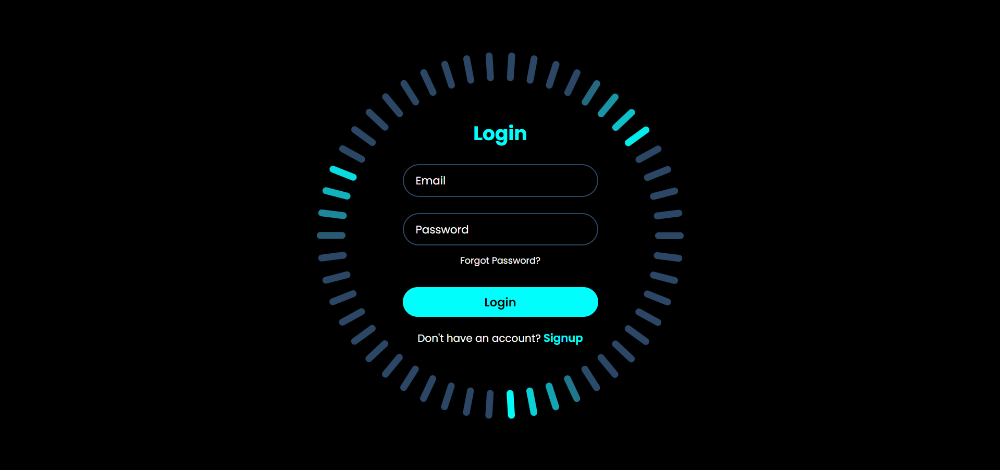

# Login Form

Login Form Built Using HTML, CSS and JavaScript.

Quick links
- Live demo: (Add link if hosted, e.g. GitHub Pages)
- Repository: BinaryVortex/Login-Form-91

## About
A clean, responsive login form built with plain HTML, CSS and JavaScript. This project demonstrates form layout, lightweight validation, and modern styling techniques suitable for use as a starting point in small web projects.

## Features
- Responsive layout that works on mobile and desktop
- Client-side validation for basic fields (email/username and password)
- Accessible form elements (labels, focus states)
- Simple and customizable CSS design

## Technologies
- HTML
- CSS
- JavaScript

## Demo
To run locally:
1. Clone the repository:
   git clone https://github.com/BinaryVortex/Login-Form-91.git
2. Open `index.html` in your browser:
   - Double-click the file, or
   - Run a simple static server (recommended for testing JavaScript behavior), for example:
     - Python 3: `python -m http.server 8000` then open `http://localhost:8000`
     - Node: `npx http-server .`

## Usage
- Fill in the username/email and password fields and submit.
- The form performs basic front-end validation and will show inline feedback for missing/invalid values.
- Replace validation logic in `script.js` (or your JS file) to integrate with your back-end/auth provider.

## Customization
- Colors & typography: edit `style.css` (or the CSS file) to change fonts, colors, spacing.
- Validation rules: update `main.js` (or the JS file) to expand validation or to call an API endpoint.
- Add remember-me, forgot-password, or social login buttons as needed.

## Accessibility & Best Practices
- Ensure proper contrast for readability.
- Add ARIA attributes if integrating with complex widgets or dynamic updates.
- Sanitize and validate input on the server — client-side checks are only for UX.

## Screenshots
The screenshot below is included from the repository root.

If you'd like the image moved into an `assets/` or `images/` folder and referenced from there, I can do that.

## Contributing
Contributions are welcome. Typical contributions:
- Improve styling and responsiveness
- Add unit tests for JavaScript (if you add modular code)
- Improve accessibility and keyboard navigation

Please open issues or submit pull requests with clear descriptions of the change.

## License
Add a license file (e.g., `LICENSE`) to this repository and mention the license here. If you want, I can add an MIT license for you.

## Contact
Created by BinaryVortex. For questions or help, open an issue or contact me via GitHub.
